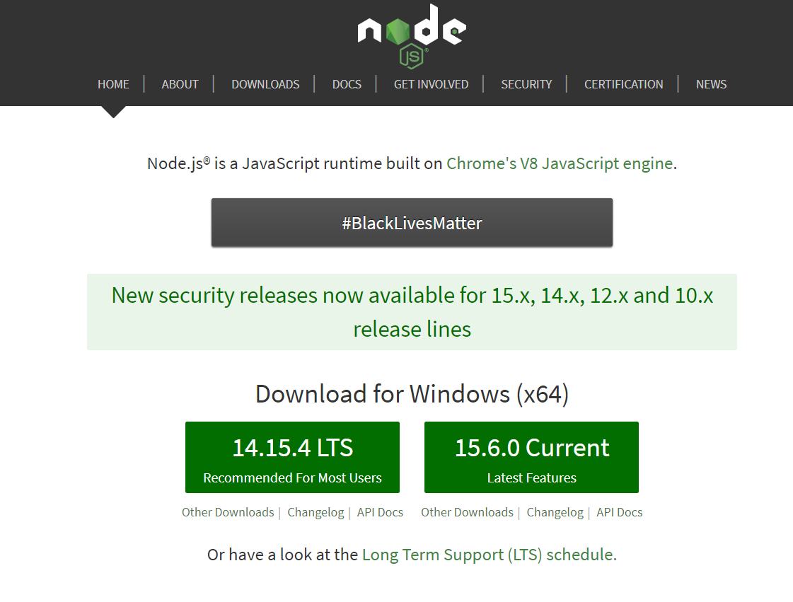
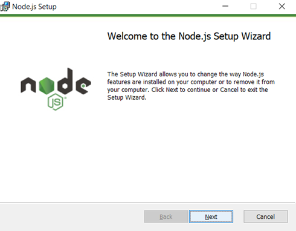
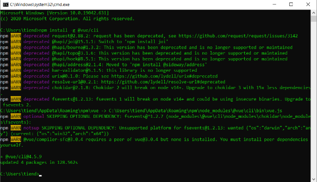
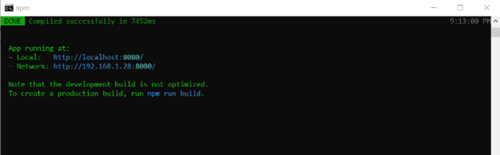

# Project web bán điện thoại với VueJS

## Cách bước tiến hành cài đặt

Trước khi cài đặt VueJS, ta cần phải cài đặt NodeJS trước, ta vào link download: https://nodejs.org/en/

Chọn phiên bản phù hợp và nhấn tải về



Khi tải xong, ta mở file nodejs lên và cài đặt như bình thường



Sau đó ta mở cmd lên và gõ lệnh:

```
npm install -g @vue/cli
```

Ta chờ kết quả sau khi chạy xong



Quá trình cài đặt hoàn tất

Sau đó ta mở thư mục chứa project của mình và mở cmd tai thư mục project

Gõ lệnh 

```
npm run serve
```

Lúc này project sẽ chạy trên trình duyệt với địa chỉ localhost với port là 8080



Ta mở trình duyệt lên và truy cập vào đường dẫn locahost:8080


Trang web đã hiển thị thành công!
